# 数学依赖与逐任务验收

KPω ⊢ ∀ν [UncountableOrdinal(ν) → ∃序数 χ≤ν, ∃集合函数 μ:E→χ, μ(∅)=0 ∧ ∀s≠∅ ∀N∈ω, μ(E_N(s))<μ(s)]。

最终纯 ∈ 闭句为 KP1Y.OneYTheorem.mainSentence；KP1Y.OneYTheorem.theorem1_derivable : KP1Y.Derives mainSentence。

此文件由 `plan.py` 生成；修改计划后运行 `python3 tracker/refresh.py`，不调用 Lean。

依赖边表示所需输入或验收前置；实际 Lean import 另见看板。历史成果节点不代表主定理已经完成。

```mermaid
flowchart LR
  V01["V01 原仓库：命题与证明审读"]
  F01["F01 KPω 公理、任意模型、Hilbert 桥"]
  F02["F02 集合、内部算术与递归基础"]
  F01 --> F02
  F03["F03 满意度、统一编译、初等性接口"]
  F02 --> F03
  F04["F04 构造内模型 L 与 KPω + V=L"]
  F02 --> F04
  F03 --> F04
  F05["F05 构造良序、内部 κ≤ν 与统一 e"]
  F04 --> F05
  F06["F06 R/FR 表、局部性、方程 (5)"]
  F02 --> F06
  F07["F07 具体结构与初等高度"]
  F03 --> F07
  F05 --> F07
  F06 --> F07
  F08["F08 变量族、图形索引与参数赋值"]
  F07 --> F08
  F09["F09 二元原子、基础块与前缀语义"]
  F08 --> F09
  F03 --> F09
  F10["F10 (7) 正向的归纳步与反例提取"]
  F06 --> F10
  C00["C00 冻结并行接口与所有权"]
  F08 --> C00
  F09 --> C00
  F10 --> C00
  C01["C01 R/P 紧凑原子代码与求值"]
  C00 --> C01
  F07 --> C01
  C02["C02 相邻递增原子块"]
  C00 --> C02
  F09 --> C02
  C03["C03 可容许性 Adm 原子块"]
  C00 --> C03
  F09 --> C03
  C04["C04 内部图边的 R 原子块"]
  C01 --> C04
  F08 --> C04
  C05["C05 端点模板的 P/R 原子块"]
  C01 --> C05
  F08 --> C05
  C06["C06 完整 Demand/Response 统一编译"]
  C02 --> C06
  C03 --> C06
  C04 --> C06
  C05 --> C06
  F09 --> C06
  C07["C07 反例公式、量词块与反射"]
  C06 --> C07
  F07 --> C07
  C08["C08 完成 (7)：双向等价及双重归纳"]
  C07 --> C08
  F10 --> C08
  F06 --> C08
  C09["C09 (8) 的纯前缀存在公式"]
  C02 --> C09
  C04 --> C09
  C05 --> C09
  F09 --> C09
  C10["C10 完成 (8)：初等高度的顶端反射"]
  C09 --> C10
  C08 --> C10
  C11["C11 内部有限次选取初等高度"]
  C00 --> C11
  F07 --> C11
  F02 --> C11
  C12["C12 初始表示：推论 7"]
  C11 --> C12
  C10 --> C12
  C08 --> C12
  Y00["Y00 有限组合迁移清单与编码契约"]
  V01 --> Y00
  F01 --> Y00
  F02 --> Y00
  Y06["Y06 有限复制下降：引理 3"]
  Y04b --> Y06
  Y05b --> Y06
  F06 --> Y06
  Y08["Y08 L 与外部之间的有限计算绝对性"]
  Y08a --> Y08
  Y02k --> Y08
  Y05b --> Y08
  O01["O01 通用对象定理：秩函数推出良基与终止"]
  F01 --> O01
  F02 --> O01
  O02["O02 通用对象定理：后代比较与字典序良序"]
  C00 --> O02
  O01 --> O02
  M01["M01 最小末标签与实际 μ 图"]
  M01a --> M01
  Y02k --> M01
  M02["M02 μ 对所有实际展开严格下降"]
  M01 --> M02
  Y06 --> M02
  M03["M03 回传实际 μ，去掉 V=L"]
  M02 --> M03
  Y08 --> M03
  F04 --> M03
  F05 --> M03
  M04["M04 实例化良基与轨迹终止"]
  M03 --> M04
  O01 --> M04
  Y07r --> M04
  M05["M05 封闭句子与实际 Hilbert Derives"]
  M04 --> M05
  M04b --> M05
  F01 --> M05
  Q01["Q01 最终命题忠实性审读"]
  M05 --> Q01
  Q02["Q02 最终增量集成、公理审计与复现"]
  Q01 --> Q02
  Z01["Z01 可选：落实n-row BMS的Z₂终止证明来源"]
  V01 --> Z01
  Y01a["Y01a 实际表达式 E 与合法性"]
  Y00 --> Y01a
  F02 --> Y01a
  Y01b["Y01b 内部算术与有界搜索基础"]
  Y01a --> Y01b
  Y02a["Y02a 父森林、路径、根、深度与选择"]
  Y01b --> Y02a
  Y02b["Y02b 数值山形与实际行运行"]
  Y02a --> Y02b
  Y01c --> Y02b
  Y02d --> Y02b
  Y02c["Y02c 有限层预算与全1尾界"]
  Y02g --> Y02c
  Y03a["Y03a 有限列运输与实际帧矩阵"]
  Y01b --> Y03a
  Y02a --> Y03a
  Y01c --> Y03a
  Y02d --> Y03a
  Y03b["Y03b 完整矩阵展开、I/S保持与归一化"]
  Y03j --> Y03b
  Y03f --> Y03b
  Y04a["Y04a 唯一实际复制塔定义"]
  Y04o --> Y04a
  Y04t --> Y04a
  Y04l --> Y04a
  Y04s --> Y04a
  Y02n --> Y04a
  Y04b["Y04b 模板可容许性与反射拼接归纳"]
  Y04c --> Y04b
  Y04d --> Y04b
  F06 --> Y04b
  Y05a["Y05a 通用有限重建与燃料算法"]
  Y01d --> Y05a
  Y02a --> Y05a
  Y05b["Y05b 规范重新提取与根图对应"]
  Y05c --> Y05b
  Y04z --> Y05b
  Y04x --> Y05b
  Y03k --> Y05b
  Y02m --> Y05b
  Y05n --> Y05b
  Y05p --> Y05b
  Y05o --> Y05b
  Y01c["Y01c 共享全局减法表与序关系"]
  Y01b --> Y01c
  Y02d["Y02d 共享线性森林与前缀祖先"]
  Y02a --> Y02d
  Y01d["Y01d 共享全局加乘表及代数律"]
  Y01b --> Y01d
  Y01c --> Y01d
  Y03c["Y03c 实际有限矩阵展开核心"]
  Y03a --> Y03c
  Y01d --> Y03c
  Y04p["Y04p 1-Y复制坐标的精确内部桥"]
  Y03c --> Y04p
  Y02a --> Y04p
  Y02e["Y02e 高度与顶部值的实际函数图"]
  Y02b --> Y02e
  Y02f["Y02f 伪父选择与单次真实提取"]
  Y02e --> Y02f
  Y02a --> Y02f
  Y02g["Y02g 提取证书与完整内部层运行"]
  Y02f --> Y02g
  F02 --> Y02g
  Y02n["Y02n 坏根搜索与唯一性"]
  Y02c --> Y02n
  Y02f --> Y02n
  Y02j["Y02j 内部有限过滤与稳定枚举"]
  Y01a --> Y02j
  F02 --> Y02j
  Y02k["Y02k 规范根图 A(s) 与实际全局图"]
  Y02c --> Y02k
  Y02j --> Y02k
  F06 --> Y02k
  Y02m["Y02m 完整山形与规范图的前缀局部性"]
  Y02k --> Y02m
  Y03d["Y03d 任意有限矩阵的真实父运行"]
  Y03c --> Y03d
  Y03e["Y03e 共同祖先链上的选择与深度比较"]
  Y02a --> Y03e
  Y03g["Y03g 矩阵结构条件与列后缀次序"]
  Y03c --> Y03g
  Y03h["Y03h 展开前缀与接缝数值事实"]
  Y03c --> Y03h
  Y03d --> Y03h
  Y03g --> Y03h
  Y03i["Y03i 局部父行嵌入与路径运输"]
  Y02a --> Y03i
  Y03f["Y03f 复制列提升保序与虚拟末列比较"]
  Y03e --> Y03f
  Y03g --> Y03f
  Y03h --> Y03f
  Y03j["Y03j 复制父图与真实父算法相等"]
  Y03h --> Y03j
  Y03i --> Y03j
  Y03f --> Y03j
  Y04p --> Y03j
  Y03q --> Y03j
  Y03s --> Y03j
  Y03k["Y03k 活动帧实例与装饰接缝比较"]
  Y03b --> Y03k
  Y02f --> Y03k
  Y03v --> Y03k
  Y04c["Y04c 复制的源事实与端点模板"]
  Y04a --> Y04c
  Y02k --> Y04c
  F06 --> Y04c
  Y04x --> Y04c
  Y04d["Y04d 真实复制边分类与 BlockScheme"]
  Y04a --> Y04d
  Y03k --> Y04d
  Y02m --> Y04d
  Y04x --> Y04d
  Y04z --> Y04d
  Y05c["Y05c 实际 E_N 函数图与所有算法分支"]
  Y04a --> Y05c
  Y05r --> Y05c
  Y01a --> Y05c
  Y05s --> Y05c
  Y07r["Y07r 实际有限 Reach 集合与首步分解"]
  Y05c --> Y07r
  F02 --> Y07r
  Y07l["Y07l 实际 Lex 集合与前缀次序"]
  Y01a --> Y07l
  F02 --> Y07l
  Y07a["Y07a 实际展开的字典序与前缀事实"]
  Y05b --> Y07a
  Y07r --> Y07a
  Y07l --> Y07a
  Y07b["Y07b 实际 Seeds 与共同种子祖先"]
  Y07a --> Y07b
  Y08a["Y08a L 内外的有限编码域一致"]
  Y01a --> Y08a
  F04 --> Y08a
  M01a["M01a 任意根图的最小末标签"]
  C12 --> M01a
  F06 --> M01a
  M04b["M04b 实例化 Desc/G 字典序良序"]
  M03 --> M04b
  O02 --> M04b
  Y07a --> M04b
  Y07b --> M04b
  Y03q["Y03q 候选复制森林与完整祖先几何"]
  Y03h --> Y03q
  Y03i --> Y03q
  Y04p --> Y03q
  Y03e --> Y03q
  Y03s["Y03s 高行与坏部父项的真实选择识别"]
  Y03q --> Y03s
  Y03f --> Y03s
  Y03h --> Y03s
  Y02p["Y02p 提取/层祖先与实际低层根高度"]
  Y02g --> Y02p
  Y02n --> Y02p
  Y02a --> Y02p
  Y04o["Y04o 普通复制坐标与实际共同山形"]
  Y04p --> Y04o
  Y02g --> Y04o
  Y04t["Y04t 活跃层Terminal复制"]
  Y04o --> Y04t
  Y02n --> Y04t
  Y04r["Y04r 低层复制的行移位算术"]
  Y01d --> Y04r
  Y04l["Y04l 低层Lower复制"]
  Y04o --> Y04l
  Y02p --> Y04l
  Y04r --> Y04l
  Y04s["Y04s 统一山形及三分支有界证书"]
  Y04o --> Y04s
  Y04t --> Y04s
  Y04l --> Y04s
  Y05r["Y05r 实际单层与有限塔数值重建"]
  Y05a --> Y05r
  Y04s --> Y05r
  Y03v["Y03v 复制Top图与装饰矩阵展开保持"]
  Y03b --> Y03v
  Y03f --> Y03v
  Y04o --> Y03v
  Y05s["Y05s 复制塔的有界集合证书"]
  Y04a --> Y05s
  Y04x["Y04x 复制根及源父记录的真实运输"]
  Y04a --> Y04x
  Y02m --> Y04x
  Y03k --> Y04x
  Y04z["Y04z 复制塔的规范原子表及实际图"]
  Y04a --> Y04z
  Y02j --> Y04z
  F06 --> Y04z
  Y05n["Y05n 三种复制的相邻父行精化"]
  Y04a --> Y05n
  Y04x --> Y05n
  Y02m --> Y05n
  Y05p["Y05p 图层伪父候选与实际父图"]
  Y04a --> Y05p
  F02 --> Y05p
  Y05o["Y05o 普通复制数值与重新提取"]
  Y05r --> Y05o
  Y04x --> Y05o
  Y05n --> Y05o
  Y02m --> Y05o
  Z02["Z02 DH/BM4仓库：KP强度源码审读"]
  V01 --> Z02
```

## V01 · 原仓库：命题与证明审读

已核对原项目的合法表达式、实际展开和字典序；良序结论限于 Desc(s) 与生成集 G。

前置：无。输入：原克隆提交 6533b2975f3cafb3582dc8f8127e9ea7144d7e69；宿主 Lean 证明。

负责文件：既有成果，只读。

快照状态：historical；未就绪前置：无。

验收：

- 原项目独立检查和 210 项声明审计已有记录。
- 宿主证明的完成不计作对象 KPω 主定理完成。

注意：这是已有审读记录；当前看板没有重新编译原项目。

证据：[REVIEW.zh-CN.md](../../verification-1y/REVIEW.zh-CN.md)、[verification-status.json](../../verification-1y/verification-status.json)、[StatementAudit.lean](../../verification-1y/StatementAudit.lean)

## F01 · KPω 公理、任意模型、Hilbert 桥

纯 ∈ 理论包含完整集合归纳；从任意 KP 模型语义经完备性取得实际 Derives。

前置：无。输入：YesMetaZFC 的一阶语法、Hilbert 核与完备性。

负责文件：既有成果，只读。

快照状态：verified；未就绪前置：无。

验收：

- 对象理论没有加入 AC、幂集、完整分离或替换。
- 不假设宿主 WellFounded mem 或模型 ω 标准。

证据：[Axioms.lean](../KP1Y/Axioms.lean)、[Model.lean](../KP1Y/Model.lean)

## F02 · 集合、内部算术与递归基础

集合函数、有限序列、Σ₁ 收集、Δ₁ 分离及有界/Σ₁ 递归的存在唯一性。

前置：F01。输入：所有变量长度均为对象模型中的 n∈ω。

负责文件：既有成果，只读。

快照状态：verified；未就绪前置：无。

验收：

- 递归产物是实际集合图，含所有前缀的总性和唯一性。

证据：[NaturalInduction.lean](../KP1Y/NaturalInduction.lean)、[FunctionGraphs.lean](../KP1Y/FunctionGraphs.lean)、[SequenceSpaces.lean](../KP1Y/SequenceSpaces.lean)、[SigmaRecursion.lean](../KP1Y/SigmaRecursion.lean)、[DeltaOneSeparation.lean](../KP1Y/DeltaOneSeparation.lean)

## F03 · 满意度、统一编译、初等性接口

实际有限程序的满意度集合、内部任意长度合取/量词块编译与程序初等性。

前置：F02。输入：同一程序代码在大小解释中求值。

负责文件：既有成果，只读。

快照状态：verified；未就绪前置：无。

验收：

- 有编译正确性、变量作用域和实际满意度的联系。

证据：[SatisfactionTruth.lean](../KP1Y/SatisfactionTruth.lean)、[UniformFiniteTemplates.lean](../KP1Y/UniformFiniteTemplates.lean)、[ProgramElementarity.lean](../KP1Y/ProgramElementarity.lean)、[TarskiVaught.lean](../KP1Y/TarskiVaught.lean)

## F04 · 构造内模型 L 与 KPω + V=L

完整 L 层级、类内模型的 KPω（含收集及完整归纳）、相同 ω 与序数、内部 V=L。

前置：F02, F03。输入：使用对象归纳和集合证书。

负责文件：既有成果，只读。

快照状态：verified；未就绪前置：无。

验收：

- 内模型不是额外假设；存在性与相应公理逐项导出。

证据：[ConstructibleKP.lean](../KP1Y/ConstructibleKP.lean)、[ConstructibleVL.lean](../KP1Y/ConstructibleVL.lean)、[ConstructibleOrdinalContent.lean](../KP1Y/ConstructibleOrdinalContent.lean)、[CanonicalSyntaxInside.lean](../KP1Y/CanonicalSyntaxInside.lean)

## F05 · 构造良序、内部 κ≤ν 与统一 e

从外部不可数 ν 得到 L 内最小不可数 κ≤ν，以及统一可数枚举 e。

前置：F04。输入：实际构造良序、最小选择及函数图。

负责文件：既有成果，只读。

快照状态：verified；未就绪前置：无。

验收：

- 选择的图由弱理论可用的集合构造得到。
- 不要求 κ 在外部仍不可数。

证据：[ConstructibleWellorder.lean](../KP1Y/ConstructibleWellorder.lean)、[ConstructibleEnumeration.lean](../KP1Y/ConstructibleEnumeration.lean)、[InnerEnumeration.lean](../KP1Y/InnerEnumeration.lean)

## F06 · R/FR 表、局部性、方程 (5)

按 (b,K,θ) 序数阶段递归构造实际 R 表；证明严格端点、反射和根弱化。

前置：F02。输入：Reflection.Data、Table、Diagram、Template、Representation、Demand、Response。

负责文件：既有成果，只读。

快照状态：verified；未就绪前置：无。

验收：

- 具体递归行的 Local 已证明；不是把局部性当输入。
- 内部图边允许任意层 k；只有端点模板受 Adm 约束。

证据：[ReflectionTable.lean](../KP1Y/ReflectionTable.lean)、[ReflectionSemantics.lean](../KP1Y/ReflectionSemantics.lean)、[ReflectionLabelDomain.lean](../KP1Y/ReflectionLabelDomain.lean)

## F07 · 具体结构与初等高度

实际构造 A=(κ;<,R,P,e,ω) 的关系化结构和初等高度 δ。

前置：F03, F05, F06。输入：ArticleData、ArticleStructure.Valid、Height。

负责文件：既有成果，只读。

快照状态：verified；未就绪前置：无。

验收：

- δ<κ，ω、γ<δ；六个关系的含义逐项对应文稿。
- 限制载域到 δ 时 top 仍为原 κ。

证据：[ReflectionStructure.lean](../KP1Y/ReflectionStructure.lean)、[ReflectionModelHeight.lean](../KP1Y/ReflectionModelHeight.lean)、[ReflectionAtomicBridge.lean](../KP1Y/ReflectionAtomicBridge.lean)

## F08 · 变量族、图形索引与参数赋值

内部任意宽度的无碰撞变量名；层参数、标量及输入/输出变量族的实际赋值。

前置：F07。输入：TemplateShape、NameFrame.Valid、GroundParameters。

负责文件：既有成果，只读。

快照状态：verified；未就绪前置：无。

验收：

- 通过内部集合函数和同步覆盖构造，未用宿主有限次选择替代内部有限长度。

证据：[ReflectionTemplateShape.lean](../KP1Y/ReflectionTemplateShape.lean)、[ReflectionNameFrame.lean](../KP1Y/ReflectionNameFrame.lean)、[ReflectionGroundParameters.lean](../KP1Y/ReflectionGroundParameters.lean)、[AssignmentFamilyPatch.lean](../KP1Y/AssignmentFamilyPatch.lean)

## F09 · 二元原子、基础块与前缀语义

等号/小于原子块；正标签、cut 等式、输出界、前缀一致及大小结构候选限制。

前置：F08, F03。输入：UniformConjoinBlock、BasicBlocks、PrefixValues、frame_restrict_below_cut。

负责文件：既有成果，只读。

快照状态：verified；未就绪前置：无。

验收：

- 基础块的对象语义已核验；完整 Demand/Response 由后续 C06 交付。

证据：[ReflectionBasicCompilation.lean](../KP1Y/ReflectionBasicCompilation.lean)、[ReflectionBasicHeight.lean](../KP1Y/ReflectionBasicHeight.lean)、[ReflectionPrefixBlock.lean](../KP1Y/ReflectionPrefixBlock.lean)、[ReflectionOutputRestriction.lean](../KP1Y/ReflectionOutputRestriction.lean)、[UniformConjoinBlock.lean](../KP1Y/UniformConjoinBlock.lean)

## F10 · (7) 正向的归纳步与反例提取

在 TopAgreementBefore 假设下证明 P→Rδ；从 ¬P 提取实际有限反例。

前置：F06。输入：ReflectionTopInduction 中现有接口。

负责文件：既有成果，只读。

快照状态：verified；未就绪前置：无。

验收：

- 保留归纳假设的边界；不能把此项算作完整 (7)。

证据：[ReflectionTopInduction.lean](../KP1Y/ReflectionTopInduction.lean)

## C00 · 冻结并行接口与所有权

已冻结现有反射编译接口、索引块和参数槽位，明确有限算法与通用秩的独立交接边界。

前置：F08, F09, F10。输入：本看板给出拟定契约；实施前由协调者确认，避免同时改基础类型。

负责文件：tracker/CONTRACTS.md。

快照状态：verified；未就绪前置：无。

验收：

- 记录字段、参数编号、命名空间、预期 theorem 类型及允许 imports。
- 确认下列任务的负责文件互不重叠。
- 不因计划写好了就标记接口冻结通过。

注意：反射接口已冻结；实际算法编码由独立 Y00 任务交付。

证据：[CONTRACTS.md](./CONTRACTS.md)

## C01 · R/P 紧凑原子代码与求值

构造三元 P、四元 R 的代码，证明存在、唯一、作用域、大小解释中的精确语义。

前置：C00, F07。输入：AtomCode、Height.evaluate_atom_d；固定元数可以用 Fin，图形宽度必须内部化。

负责文件：KP1Y/ReflectionRelationCode.lean, KP1Y/ReflectionRelationCodeTruth.lean。

快照状态：verified；未就绪前置：无。

验收：

- P(k,η,a) 精确读取 R(k,η,a,κ)。
- 代码参数是变量名；不能误把语义标签塞进变量代码。
- 同一代码用于大小结构。

证据：[ReflectionRelationCode.lean](../KP1Y/ReflectionRelationCode.lean)、[ReflectionRelationCodeTruth.lean](../KP1Y/ReflectionRelationCodeTruth.lean)

## C02 · 相邻递增原子块

为 f/g 生成相邻 Less 原子块，证明合取恰好是严格递增。

前置：C00, F09。输入：BinaryBlock、AdjacentIncreasing ↔ Increasing、内部后继索引。

负责文件：KP1Y/ReflectionIncreasingBlock.lean。

快照状态：verified；未就绪前置：无。

验收：

- 覆盖宽度 0/1 或明确消费 TemplateShape 的非空前提。
- 用对象自然数归纳处理任意内部长度。

证据：[ReflectionIncreasingBlock.lean](../KP1Y/ReflectionIncreasingBlock.lean)

## C03 · 可容许性 Adm 原子块

按固定图形索引和 K 选择真/假/小于原子，准确编译 Adm。

前置：C00, F09。输入：k<K，或 k=K 且 q<c 且 f(q)<θ；GroundParameters 中 θ 的槽位。

负责文件：KP1Y/ReflectionAdmissionBlock.lean。

快照状态：verified；未就绪前置：无。

验收：

- k<K 对应真；同层合法根对应 Less；其余对应假。
- 不向内部图边添加 k<K 限制。

证据：[ReflectionAdmissionBlock.lean](../KP1Y/ReflectionAdmissionBlock.lean)

## C04 · 内部图边的 R 原子块

逐条 EdgeEntry 生成 R(k,fq,fp,fj) 和输出 g 的对应块。

前置：C01, F08。输入：EdgeEntry 存在唯一、列界、NameFrame、C01 四元代码。

负责文件：KP1Y/ReflectionEdgeBlocks.lean, KP1Y/ReflectionEdgeBlockTruth.lean。

快照状态：verified；未就绪前置：无。

验收：

- 任意内部 edgeLength 的实际代码图。
- 大小结构 AllAtoms 与原 Representation 中图边条件等价。

证据：[ReflectionEdgeBlocks.lean](../KP1Y/ReflectionEdgeBlocks.lean)、[ReflectionEdgeBlockTruth.lean](../KP1Y/ReflectionEdgeBlockTruth.lean)

## C05 · 端点模板的 P/R 原子块

分别构造顶端 P(k,fq,fp)、输出 R(k,gq,gp,a) 与供 (8) 使用的 P(k,gq,gp)。

前置：C01, F08。输入：NeedEntry、层参数、point 标量槽位、C01。

负责文件：KP1Y/ReflectionEndpointBlocks.lean, KP1Y/ReflectionEndpointBlockTruth.lean。

快照状态：verified；未就绪前置：无。

验收：

- 输出 End_a 用四元 R，不能误用 P。
- (8) 的存在公式另用 P，不能带 δ 常元。

证据：[ReflectionEndpointBlocks.lean](../KP1Y/ReflectionEndpointBlocks.lean)、[ReflectionEndpointBlockTruth.lean](../KP1Y/ReflectionEndpointBlockTruth.lean)

## C06 · 完整 Demand/Response 统一编译

把基础、递增、图边、端点和前缀块组合成完整输入/输出公式。

前置：C02, C03, C04, C05, F09。输入：统一合取扩展、参数赋值、输入/输出量词框架。

负责文件：KP1Y/ReflectionTemplateCompilation.lean, KP1Y/ReflectionTemplateTruth.lean, KP1Y/ReflectionLabelingBridge.lean, KP1Y/ReflectionTemplateEnvironment.lean。

快照状态：verified；未就绪前置：无。

验收：

- 实际 CompiledExtension 与同一代码的大小解释正确性。
- Demand 和 Response 的每一个合取项均有双向等价。
- 保留所有内部变量与图形长度。

证据：[ReflectionTemplateCompilation.lean](../KP1Y/ReflectionTemplateCompilation.lean)、[ReflectionTemplateTruth.lean](../KP1Y/ReflectionTemplateTruth.lean)、[ReflectionLabelingBridge.lean](../KP1Y/ReflectionLabelingBridge.lean)、[ReflectionTemplateEnvironment.lean](../KP1Y/ReflectionTemplateEnvironment.lean)

## C07 · 反例公式、量词块与反射

构造 ∃f (Input(f) ∧ ¬∃g Output(f,g)) 并从 κ 反射到 δ。

前置：C06, F07。输入：ProgramElementary.reflect_counterexample_d；frame_restrict_below_cut。

负责文件：KP1Y/ReflectionCounterexampleCompilation.lean, KP1Y/ReflectionCounterexampleTransfer.lean。

快照状态：verified；未就绪前置：无。

验收：

- 所有自由参数属于 δ。
- 证明候选输出 <a<δ 时大小载域的候选集合与真值一致。
- 由真实满意度反射得到反例，而非直接假设反射结论。

证据：[ReflectionCounterexampleCompilation.lean](../KP1Y/ReflectionCounterexampleCompilation.lean)、[ReflectionCounterexampleTransfer.lean](../KP1Y/ReflectionCounterexampleTransfer.lean)

## C08 · 完成 (7)：双向等价及双重归纳

对内部 K，再对 θ 归纳，消除 TopAgreementBefore，得到 P(K,θ,a)↔R(K,θ,a,δ)。

前置：C07, F10, F06。输入：已有正向归纳步 + C07 反例传输。

负责文件：KP1Y/ReflectionHeightAgreement.lean。

快照状态：verified；未就绪前置：无。

验收：

- ∀K∈ω、θ≤a<δ；处理 a≤ω 的无效查询。
- 最终定理没有遗留归纳假设。

证据：[ReflectionHeightAgreement.lean](../KP1Y/ReflectionHeightAgreement.lean)

## C09 · (8) 的纯前缀存在公式

构造 ∃g [Rep(A,g) ∧ g↾c=u ∧ 顶端 P 模板]，并证明统一编译语义。

前置：C02, C04, C05, F09。输入：仅保存 f↾c；其余输入槽用 0；输出族量化全部列。

负责文件：KP1Y/ReflectionPrefixExistence.lean。

快照状态：verified；未就绪前置：无。

验收：

- 公式不含 δ、θ=δ 参数，不固定 g(c)=δ。
- 省略 cut 等式、输出<a 和 Adm 块；无用标量槽设 0。
- 即使 c=0 也可赋值。

注意：(8) 的参数合法性是单独审查点，不能直接复用 C07 的 a、θ 参数化公式。

证据：[ReflectionPrefixExistence.lean](../KP1Y/ReflectionPrefixExistence.lean)

## C10 · 完成 (8)：初等高度的顶端反射

由原 f 提供大结构存在见证，经初等性取得 g<δ，再用 (7) 改写端点。

前置：C09, C08。输入：C09 公式、Height、完整 (7)。

负责文件：KP1Y/ReflectionHeightTop.lean。

快照状态：verified；未就绪前置：无。

验收：

- 对所有 θ≤δ 证明 P(K,θ,δ)，包含 θ=δ。
- 获得原 FR 所需的实际 Response。

证据：[ReflectionHeightTop.lean](../KP1Y/ReflectionHeightTop.lean)

## C11 · 内部有限次选取初等高度

构造递增初等高度序列的实际集合图及每一行的高度证书。

前置：C00, F07, F02。输入：height_exists_d、可定义的规范选择/最小高度、已有内部递归。

负责文件：KP1Y/ReflectionHeightIteration.lean。

快照状态：verified；未就绪前置：无。

验收：

- 任意模型内部 m∈ω 的迭代；不是在 Lean 中做 m 次选择。
- 规范选择谓词可定义，集合收集/递归前提全部满足。

证据：[ReflectionHeightIteration.lean](../KP1Y/ReflectionHeightIteration.lean)

## C12 · 初始表示：推论 7

给每个有限根图实际构造 κ 以下的 Representation。

前置：C11, C10, C08。输入：递增高度序列与 R(K,θ,α,β)；接到 Reflection.Diagram。

负责文件：KP1Y/ReflectionInitialRepresentation.lean。

快照状态：verified；未就绪前置：无。

验收：

- 每个图边均由 (8) 和 (7) 验证。
- 宽度 0 返回空表示；任意层号均覆盖。

证据：[ReflectionInitialRepresentation.lean](../KP1Y/ReflectionInitialRepresentation.lean)

## Y00 · 有限组合迁移清单与编码契约

已核对79条源码声明、45条实际调用边，冻结内部表达式/森林/复制编码契约，并据此细分有限组合任务。

前置：V01, F01, F02。输入：OneY/RootIndexed/ExpansionWellFounded.lean:54；ZeroY/Structural 与 BM4。

负责文件：tracker/FINITE-PORT-CONTRACT.md, tracker/finite-port-map.json。

快照状态：verified；未就绪前置：无。

验收：

- 区分有限算术引理与宿主良基性/0-Y 假设。
- 确认引用覆盖带帧及非标准状态；记录所需精确统一性。
- 列出翻译到任意 KP 模型后的 theorem 形状。

注意：源码调用审查已确认有限复制下降主链不消费 WF(0-Y/BM4)；原导入闭包中的良基性出口是旁支。

证据：[FINITE-PORT-CONTRACT.md](./FINITE-PORT-CONTRACT.md)、[finite-port-map.json](./finite-port-map.json)

## Y06 · 有限复制下降：引理 3

原表达式有末标签 β 的表示时，非空展开有末标签 <β 的表示。

前置：Y04b, Y05b, F06。输入：Y04 复制不变量、Y05 规范重建、F06 的严格性/弱化/FR。

负责文件：KP1Y/OneYCopyDescent.lean。

快照状态：verified；未就绪前置：无。

验收：

- 精确消费现有 Reflection 表接口；没有复制引理公理。
- 删除、无坏根、复制及非空结果的所有分支覆盖。
- 结论量化任意内部 N∈ω。

注意：copy_descent无条件（OneYMainTheorem）。

证据：[OneYCopyDescent.lean](../KP1Y/OneYCopyDescent.lean)、[OneYMainTheorem.lean](../KP1Y/OneYMainTheorem.lean)

## Y08 · L 与外部之间的有限计算绝对性

同一个表达式、山形、展开计算证书在 L 与外部给出相同值。

前置：Y08a, Y02k, Y05b。输入：内外相同 ω、传递性与图/序列绝对性；Y01/Y05 的真实计算谓词。

负责文件：KP1Y/OneYRankStatement.lean, KP1Y/OneYInnerAbsoluteness.lean, KP1Y/OneYInnerAbsolutenessExpansion.lean。

快照状态：verified；未就绪前置：无。

验收：

- 内部存在性、证书向上绝对性与外部唯一性识别同一个实际展开。
- 覆盖全部内部输入，非仅每个标准输入。

证据：[OneYRankStatement.lean](../KP1Y/OneYRankStatement.lean)、[OneYInnerAbsoluteness.lean](../KP1Y/OneYInnerAbsoluteness.lean)、[OneYInnerAbsolutenessExpansion.lean](../KP1Y/OneYInnerAbsolutenessExpansion.lean)

## O01 · 通用对象定理：秩函数推出良基与终止

从实际集合秩函数的严格下降，证明任意非空子集有极小元、集合编码轨迹到达终点。

前置：F01, F02。输入：实际 ordinal、Graph 与可定义单步关系；具体 1-Y 作为稍后的实例。

负责文件：KP1Y/RankedDynamics.lean。

快照状态：verified；未就绪前置：无。

验收：

- 用值域最小序数；不要求 dependent choice。
- 清楚保留秩函数与下降作为通用定理前提，不当作最终结论。

证据：[RankedDynamics.lean](../KP1Y/RankedDynamics.lean)

## O02 · 通用对象定理：后代比较与字典序良序

在前缀可达、展开单调、种子共同祖先等精确假设下，用秩归纳比较后代。

前置：C00, O01。输入：C00 的通用 reachability 接口；之后由 Y07 实例化。

负责文件：KP1Y/RankedDescendantOrder.lean。

快照状态：verified；未就绪前置：无。

验收：

- Desc(s) 含自身，G 为种子后代并集。
- 只对 Desc(s)/G 建立字典序与严格可达对应。
- 不推出全体合法表达式 E 的字典序良序。

证据：[RankedDescendantOrder.lean](../KP1Y/RankedDescendantOrder.lean)

## M01 · 最小末标签与实际 μ 图

在内部 V=L 下，由表示末标签集合的最小元构造 μ:E→κ，空表达式取 0。

前置：M01a, Y02k。输入：根图最小值接口 + 实际 E→A(s)；不等待坏根、复制或展开。

负责文件：KP1Y/OneYMinimumRank.lean。

快照状态：verified；未就绪前置：无。

验收：

- 是实际集合函数，非仅每个 s 存在某个秩。
- 每个非空 s 有实现 μ(s) 的表示，且 μ(s)>0。

证据：[OneYMinimumRank.lean](../KP1Y/OneYMinimumRank.lean)

## M02 · μ 对所有实际展开严格下降

用有限复制下降和最小化证明 μ(E_N(s))<μ(s)。

前置：M01, Y06。输入：非空输出用 Y06；空输出用 μ(s)>0。

负责文件：KP1Y/OneYRankDescentStatement.lean, KP1Y/OneYRankDescent.lean。

快照状态：verified；未就绪前置：无。

验收：

- ∀非空 s∈E，∀N∈ω；所有展开分支覆盖。
- 没有新增语义反射或初始表示前提。

注意：经copy_descent无条件。

证据：[OneYRankDescentStatement.lean](../KP1Y/OneYRankDescentStatement.lean)、[OneYRankDescent.lean](../KP1Y/OneYRankDescent.lean)

## M03 · 回传实际 μ，去掉 V=L

把 L 中同一个秩函数作为外部集合见证，得到某序数 χ≤ν 上的下降秩。

前置：M02, Y08, F04, F05。输入：inner_least_uncountable_enumeration_d；Y08 的算法绝对性。

负责文件：KP1Y/OneYRankTransfer.lean。

快照状态：verified；未就绪前置：无。

验收：

- 外部 μ:E→χ，χ≤ν；μ 的载域与展开含义未改变。
- 回传的是集合秩见证，不是 L 内没有降链的断言。

注意：经copy_descent无条件。

证据：[OneYRankTransfer.lean](../KP1Y/OneYRankTransfer.lean)

## M04 · 实例化良基与轨迹终止

把真实 μ 和实际展开/Reach 接到通用秩定理，得到内部单步良基与每条集合编码轨迹到空。

前置：M03, O01, Y07r。输入：实际 μ、实际 EN、前缀/种子数值事实。

负责文件：KP1Y/OneYWellFounded.lean。

快照状态：verified；未就绪前置：无。

验收：

- 解除 O01 的实际秩及下降前提。
- 不额外使用选择或依赖选择。

证据：[OneYWellFounded.lean](../KP1Y/OneYWellFounded.lean)

## M05 · 封闭句子与实际 Hilbert Derives

将精确主定理和推论封装为纯 ∈ 闭句，经完备性得到 KP1Y.Derives。

前置：M04, M04b, F01。输入：最终模型定理对任意 M.Models KP1Y.theory；所有编码含义已核对。

负责文件：KP1Y/OneYTheoremData.lean, KP1Y/OneYTheoremClauses.lean, KP1Y/OneYTheoremSentence.lean, KP1Y/OneYTheorem.lean, KP1Y/OneYTheoremInputs.lean, KP1Y/OneYMainAssembly.lean。

快照状态：verified；未就绪前置：无。

验收：

- 纯 ∈ 闭句为 ∀ν (UncountableOrdinal(ν) → ∃χ≤ν ∃μ …)。
- 所有自由参数消除，无语义代理或额外假设。

注意：theorem1_derivable : KP1Y.Derives mainSentence，无前提；审计仅三项Lean元公理。

证据：[OneYTheoremSentence.lean](../KP1Y/OneYTheoremSentence.lean)、[OneYTheorem.lean](../KP1Y/OneYTheorem.lean)、[OneYMainAssembly.lean](../KP1Y/OneYMainAssembly.lean)、[OneYMainAssemblyCanonical.lean](../KP1Y/OneYMainAssemblyCanonical.lean)、[OneYMainTheorem.lean](../KP1Y/OneYMainTheorem.lean)

## Q01 · 最终命题忠实性审读

逐项对照 PDF 定理 1、原算法、纯 ∈ 句子及完整推导。

前置：M05。输入：主定理展开打印、有限算法编码对应、引理依赖图。

负责文件：tracker/FINAL-STATEMENT-REVIEW.md。

快照状态：verified；未就绪前置：无。

验收：

- 检查 KP 公理表、内部 N、继承祖先、额外复制次数和 χ≤ν。
- 检查空表达式、全部合法表达式的秩域、Desc/G 的良序域。
- 条件接口全部由实际实现消除；不把源码文件名当作完成证据。

注意：Q01审读完成：无FINDING（LANE-E五路审读+LANE-A独立复核；kpsim.py对y1/engine.js差分223,952例0不符）。待Y05b接上后复核主定理无前提。

证据：[FINAL-STATEMENT-REVIEW.md](./FINAL-STATEMENT-REVIEW.md)、[COPY-TOWER-FIDELITY.md](review/COPY-TOWER-FIDELITY.md)

## Q02 · 最终增量集成、公理审计与复现

协调者统一根 imports、Audit.lean；检查实际依赖闭包并出具复现记录。

前置：Q01。输入：逐模块日志、严格阶段清单、源哈希、最终闭句审读。

负责文件：KP1Y.lean, Audit.lean, tracker/FINAL-VERIFICATION.md。

快照状态：verified；未就绪前置：无。

验收：

- 受影响模块增量检查全部通过，所选最终声明依赖无 sorryAx/新增公理。
- 记录编译器、第三方来源和改动、当前完整快照。
- 只有此关口通过才可报告完整证明完成。

证据：[FINAL-VERIFICATION.md](./FINAL-VERIFICATION.md)

## Z01 · 可选：落实n-row BMS的Z₂终止证明来源

用户已澄清任意有限n-row BMS/0-Y(1,n)的Z₂终止结果；核对具体来源、n量词形状与可复用对象翻译。

前置：V01。输入：2026-09-14用户补充；PTO(BMS)=PTO(Z₂)仅为猜想。

负责文件：tracker/Z2-REUSE-REVIEW.md。

快照状态：ready；未就绪前置：无。

验收：

- 区分每个固定行数与所有行数统一、强度比较与解释保持。
- 若获得可复用对象推导，明确翻译与适用的带帧状态。
- 没有来源时明确记录未知，主线继续迁移有限组合引理。

注意：不由数学上界直接得到现成对象推导，不把逐n族与统一∀n互换；当前有限结构主线不依赖该良基性出口。

证据：[Z2-REUSE-REVIEW.md](./Z2-REUSE-REVIEW.md)

## Y01a · 实际表达式 E 与合法性

实际 E、字面 Legal、长度唯一、空表达式、合法前缀/删除和 seeds。

前置：Y00, F02。输入：Y00 冻结契约；现有函数图、序列空间与自然数归纳。

负责文件：KP1Y/OneYExpression.lean。

快照状态：verified；未就绪前置：无。

验收：

- 实际 E、字面 Legal、长度唯一、空表达式、合法前缀/删除和 seeds。
- 所有可变长度/数值在任意 KP 模型的内部ω；实际公式与集合图，稳定模块及审计通过。

注意：具体源对应与接口见 FINITE-PORT-CONTRACT.md；不能以条件字段代替所需实际存在性。

证据：[OneYExpression.lean](../KP1Y/OneYExpression.lean)

## Y01b · 内部算术与有界搜索基础

后继/前驱、给定Δ0谓词的有界最右搜索、加法闭合及图、截断差的实际迭代。未声称已实现通用 Run 或全部乘除法。

前置：Y01a。输入：Y00 冻结契约；现有函数图、序列空间与自然数归纳。

负责文件：KP1Y/OneYFiniteComputation.lean。

快照状态：verified；未就绪前置：无。

验收：

- 后继/前驱、给定Δ0谓词的有界最右搜索、加法闭合及图、截断差的实际迭代。未声称已实现通用 Run 或全部乘除法。
- 所有可变长度/数值在任意 KP 模型的内部ω；实际公式与集合图，稳定模块及审计通过。

注意：具体源对应与接口见 FINITE-PORT-CONTRACT.md；不能以条件字段代替所需实际存在性。

证据：[OneYFiniteComputation.lean](../KP1Y/OneYFiniteComputation.lean)

## Y02a · 父森林、路径、根、深度与选择

实际部分父图、内部有限路径及长度界、根/深度存在唯一和实际图、最右继承选择、前缀局部性。

前置：Y01b。输入：原 OneY.Build/Extraction/Forest 依赖；Y01 证书。

负责文件：KP1Y/OneYAncestry.lean, KP1Y/OneYForestPaths.lean, KP1Y/OneYForestSelection.lean, KP1Y/OneYForestClosure.lean。

快照状态：verified；未就绪前置：无。

验收：

- 实际部分父图、内部有限路径及长度界、根/深度存在唯一和实际图、最右继承选择、前缀局部性。
- 所有可变长度/数值在任意 KP 模型的内部ω；实际公式与集合图，稳定模块及审计通过。

注意：具体源对应与接口见 FINITE-PORT-CONTRACT.md；不能以条件字段代替所需实际存在性。

证据：[OneYAncestry.lean](../KP1Y/OneYAncestry.lean)、[OneYForestPaths.lean](../KP1Y/OneYForestPaths.lean)、[OneYForestSelection.lean](../KP1Y/OneYForestSelection.lean)、[OneYForestClosure.lean](../KP1Y/OneYForestClosure.lean)

## Y02b · 数值山形与实际行运行

实际 Forest 状态集合、差分与继承父选择、RowRun 的存在唯一。公开证书包装已追加，等待当前源码重新集成。

前置：Y02a, Y01c, Y02d。输入：原 OneY.Build/Extraction/Forest 依赖；Y01 证书。

负责文件：KP1Y/OneYMountain.lean, KP1Y/OneYForestSpace.lean。

快照状态：verified；未就绪前置：无。

验收：

- 差分和继承父选择、实际行状态空间与行迭代、高度、伪父及提取。不得假设父图幂集存在。
- 所有可变长度/数值在任意 KP 模型的内部ω；实际公式与集合图，稳定模块及审计通过。

注意：具体源对应与接口见 FINITE-PORT-CONTRACT.md；不能以条件字段代替所需实际存在性。

证据：[OneYMountain.lean](../KP1Y/OneYMountain.lean)、[OneYForestSpace.lean](../KP1Y/OneYForestSpace.lean)

## Y02c · 有限层预算与全1尾界

实际层/行预算和全1尾界；给规范图一个可定义、唯一的统一有限枚举界。

前置：Y02g。输入：原 OneY.Build/Extraction/Forest 依赖；Y01 证书。

负责文件：KP1Y/OneYExtractionBounds.lean。

快照状态：verified；未就绪前置：无。

验收：

- 预算属于内部ω并由对象归纳证明。
- 单独冻结预算出口，规范图不必等待坏根搜索完成。

注意：具体源对应与接口见 FINITE-PORT-CONTRACT.md；不能以条件字段代替所需实际存在性。

证据：[OneYExtractionBounds.lean](../KP1Y/OneYExtractionBounds.lean)

## Y03a · 有限列运输与实际帧矩阵

严格列嵌入的父/祖先/根/深度双向运输，实际 cutoff 家族与有限帧矩阵，以及矩阵父图恢复。

前置：Y01b, Y02a, Y01c, Y02d。输入：ZeroY/Structural、OneY/ForestFrameMatrix 与 TerminalFrame；Y00 依赖清单。

负责文件：KP1Y/OneYFrameTransport.lean, KP1Y/OneYFrameMatrix.lean。

快照状态：verified；未就绪前置：无。

验收：

- 严格列嵌入的父/祖先/根/深度双向运输，实际 cutoff 家族与有限帧矩阵，以及矩阵父图恢复。
- 所有可变长度/数值在任意 KP 模型的内部ω；实际公式与集合图，稳定模块及审计通过。

注意：通用帧矩阵及实际父运行恢复已完成；活动数值行与复制实例仍由Y03b/后续步骤处理。

证据：[OneYFrameTransport.lean](../KP1Y/OneYFrameTransport.lean)、[OneYFrameMatrix.lean](../KP1Y/OneYFrameMatrix.lean)

## Y03b · 完整矩阵展开、I/S保持与归一化

实际父复制全行族、完整DepthRegular/AboveS保持，以及空宽度/删除/复制/trim的实际算法总性唯一已完成。

前置：Y03j, Y03f。输入：ZeroY/Structural、OneY/ForestFrameMatrix 与 TerminalFrame；Y00 依赖清单。

负责文件：KP1Y/OneYMatrixDepthExpansion.lean, KP1Y/OneYFiniteBlocker.lean, KP1Y/OneYMatrixNormalization.lean。

快照状态：verified；未就绪前置：无。

验收：

- 从实际父算法推导深度保持。
- 根/非根及高/低行的 S 条件全部证明，无候选图等同的假设。

注意：具体源对应与接口见 FINITE-PORT-CONTRACT.md；不能以条件字段代替所需实际存在性。

证据：[OneYMatrixDepthExpansion.lean](../KP1Y/OneYMatrixDepthExpansion.lean)、[OneYFiniteBlocker.lean](../KP1Y/OneYFiniteBlocker.lean)、[OneYMatrixNormalization.lean](../KP1Y/OneYMatrixNormalization.lean)

## Y04a · 唯一实际复制塔定义

将已完成三种单层复制收成同一实际有限复制塔代码函数图，覆盖每个内部层号并证明整体唯一。

前置：Y04o, Y04t, Y04l, Y04s, Y02n。输入：原 RootIndexed.ActualScheme 与 TerminalCopy 系列；抽象 R/FR 接口。

负责文件：KP1Y/OneYCopyTower.lean。

快照状态：verified；未就绪前置：无。

验收：

- Y04/Y05 共同读取同一个复制定义。
- 定义与图总性先冻结；后续几何保持另行证明。

注意：具体源对应与接口见 FINITE-PORT-CONTRACT.md；不能以条件字段代替所需实际存在性。

证据：[OneYCopyTower.lean](../KP1Y/OneYCopyTower.lean)

## Y04b · 模板可容许性与反射拼接归纳

精确 Adm、真实 FR 拼接、保留不变量及任意内部 N 次存在表示的对象归纳。

前置：Y04c, Y04d, F06。输入：原 RootIndexed.ActualScheme 与 TerminalCopy 系列；抽象 R/FR 接口。

负责文件：KP1Y/OneYCopySeamsSplice.lean, KP1Y/OneYCopySeamsStage.lean, KP1Y/OneYCopySeamsStep.lean, KP1Y/OneYCopySeamsSyntax.lean, KP1Y/OneYCopySeamsInduction.lean。

快照状态：verified；未就绪前置：无。

验收：

- 精确 Adm 与单块 FR 拼接。
- 对任意内部 N 的实际拼接图做对象归纳，得到严格递增表示。

注意：具体源对应与接口见 FINITE-PORT-CONTRACT.md；不能以条件字段代替所需实际存在性。

证据：[OneYCopySeamsSplice.lean](../KP1Y/OneYCopySeamsSplice.lean)、[OneYCopySeamsStage.lean](../KP1Y/OneYCopySeamsStage.lean)、[OneYCopySeamsStep.lean](../KP1Y/OneYCopySeamsStep.lean)、[OneYCopySeamsSyntax.lean](../KP1Y/OneYCopySeamsSyntax.lean)、[OneYCopySeamsInduction.lean](../KP1Y/OneYCopySeamsInduction.lean)

## Y05a · 通用有限重建与燃料算法

给定真实有限父行/高度/顶部图，实际构造重建网格并证明唯一、三分支方程和不同界的前缀局部性；不假设NumericRow/Selects/RowRun。

前置：Y01d, Y02a。输入：OneY.ExpansionCanonical、Reconstruction 与 Y01/Y02 编码。

负责文件：KP1Y/OneYReconstruction.lean, KP1Y/OneYReconstructionGrid.lean。

快照状态：verified；未就绪前置：无。

验收：

- 实际 valueFuel/重建函数图、唯一性、前缀局部性；输出值仍属于内部ω。
- 所有可变长度/数值在任意 KP 模型的内部ω；实际公式与集合图，稳定模块及审计通过。

注意：具体源对应与接口见 FINITE-PORT-CONTRACT.md；不能以条件字段代替所需实际存在性。

证据：[OneYReconstruction.lean](../KP1Y/OneYReconstruction.lean)、[OneYReconstructionGrid.lean](../KP1Y/OneYReconstructionGrid.lean)

## Y05b · 规范重新提取与根图对应

证明实际数值重建后重新提取恢复同一个复制塔，并识别 A(E_N(s)) 与所需图前缀。

前置：Y05c, Y04z, Y04x, Y03k, Y02m, Y05n, Y05p, Y05o。输入：实际CopyTower/Assembles、3种复制及根运输、图层装饰比较；数值恢复不依赖反射BlockScheme。原山形往返直接复用MountainReconstruction与ExpansionPrefix既有定理。

负责文件：KP1Y/OneYReconstructionCanonical.lean, KP1Y/OneYReconstructionOrder.lean, KP1Y/OneYReconstructionSelection.lean, KP1Y/OneYTerminalCanonical.lean, KP1Y/OneYTerminalTopBound.lean, KP1Y/OneYReconstructionRecovery.lean, KP1Y/OneYExpansionCanonical.lean, KP1Y/OneYReconstructionExtraction.lean, KP1Y/OneYTerminalExternal.lean, KP1Y/OneYFrameCopy.lean, KP1Y/OneYFrameCopyTransport.lean, KP1Y/OneYLowerCanonical.lean, KP1Y/OneYLowerTopBound.lean, KP1Y/OneYLowerValueTransport.lean, KP1Y/OneYLowerDepthTransport.lean, KP1Y/OneYLowerPseudoTransport.lean, KP1Y/OneYLowerUpperInputs.lean。

快照状态：verified；未就绪前置：无。

验收：

- 不用 NumericRow/Selects/RowRun 或规范性作为未解除输入。
- 覆盖所有算法分支和内部长度；给出标准编码下原算法对应。

注意：canonical_copy_bound无条件（OneYMainTheorem）。

证据：[OneYTowerCanonAssembly.lean](../KP1Y/OneYTowerCanonAssembly.lean)、[OneYTowerCanonLower.lean](../KP1Y/OneYTowerCanonLower.lean)、[OneYCanonicalExpansion.lean](../KP1Y/OneYCanonicalExpansion.lean)、[OneYLowerLayerFinal.lean](../KP1Y/OneYLowerLayerFinal.lean)、[OneYCanonHelperExits.lean](../KP1Y/OneYCanonHelperExits.lean)

## Y01c · 共享全局减法表与序关系

实际ω×ω→ω差表；差值界、正性iff b<a、严格下降、对角为0和相邻截断差的后继关系。

前置：Y01b。输入：已冻结 TruncatedDifference；供 Mountain 与 Frame 共同使用，避免重复实现。

负责文件：KP1Y/OneYNaturalDifferenceFacts.lean, KP1Y/OneYNaturalDifferenceOrder.lean。

快照状态：verified；未就绪前置：无。

验收：

- 差表通过实际迭代器家族收集得到，差值性质通过对象自然数归纳证明。

证据：[OneYNaturalDifferenceFacts.lean](../KP1Y/OneYNaturalDifferenceFacts.lean)、[OneYNaturalDifferenceOrder.lean](../KP1Y/OneYNaturalDifferenceOrder.lean)

## Y02d · 共享线性森林与前缀祖先

实际线性前驱父图及 Ancestor↔内部<，以及先前k列父图一致的局部版本。

前置：Y02a。输入：供 Mountain 初始序列和 Frame cutoff 共用。

负责文件：KP1Y/OneYLinearForest.lean。

快照状态：verified；未就绪前置：无。

验收：

- 从内部路径定义证明双向对应，不引入宿主可达闭包。

证据：[OneYLinearForest.lean](../KP1Y/OneYLinearForest.lean)

## Y01d · 共享全局加乘表及代数律

实际全局加乘表、自然闭合、加乘交换/结合/分配与序性质，以及受界截断差的加法反解。

前置：Y01b, Y01c。输入：供矩阵复制地址、数值提升和通用重建共用；数据表与后续律分文件冻结。

负责文件：KP1Y/OneYNaturalAdditionTable.lean, KP1Y/OneYNaturalAdditionFacts.lean, KP1Y/OneYNaturalMultiplication.lean, KP1Y/OneYNaturalMultiplicationLaws.lean, KP1Y/OneYNaturalMultiplicationDistributivity.lean, KP1Y/OneYNaturalDifferenceAddition.lean。

快照状态：verified；未就绪前置：无。

验收：

- 所有输入是模型内部ω；表是实际集合，律从明确对象schema归纳证明。

证据：[OneYNaturalAdditionTable.lean](../KP1Y/OneYNaturalAdditionTable.lean)、[OneYNaturalAdditionFacts.lean](../KP1Y/OneYNaturalAdditionFacts.lean)、[OneYNaturalMultiplication.lean](../KP1Y/OneYNaturalMultiplication.lean)、[OneYNaturalMultiplicationLaws.lean](../KP1Y/OneYNaturalMultiplicationLaws.lean)、[OneYNaturalMultiplicationDistributivity.lean](../KP1Y/OneYNaturalMultiplicationDistributivity.lean)、[OneYNaturalDifferenceAddition.lean](../KP1Y/OneYNaturalDifferenceAddition.lean)

## Y03c · 实际有限矩阵展开核心

非退化上下文中，实际构造BM4矩阵展开、copy/local地址及ascending数值提升；覆盖、单射、全性与唯一性。

前置：Y03a, Y01d。输入：真实最大活动父行上下文；退化删除另用前缀接口。

负责文件：KP1Y/OneYMatrixExpansion.lean。

快照状态：verified；未就绪前置：无。

验收：

- 代码逐项对应原BM4公式；不把复制后父链或relative S当输入或已完成结论。

证据：[OneYMatrixExpansion.lean](../KP1Y/OneYMatrixExpansion.lean)

## Y04p · 1-Y复制坐标的精确内部桥

按原copyIndex/copySource/move构造实际坐标图；核对(y,x]、source=x seam与首seam block=0。

前置：Y03c, Y02a。输入：复用通用地址覆盖/单射；显式区分1-Y的1-based source与BMS local。

负责文件：KP1Y/OneYCopyCoordinates.lean。

快照状态：verified；未就绪前置：无。

验收：

- 完整内部ω上的存在唯一和前缀/移动性质；不另造复制塔或全局算术。

证据：[OneYCopyCoordinates.lean](../KP1Y/OneYCopyCoordinates.lean)

## Y02e · 高度与顶部值的实际函数图

行燃料界、唯一 HeightGraph/TopValueGraph；活行与高度的等价保留原列为正的必要条件。

前置：Y02b。输入：按前置任务的冻结接口交接；具体对象和未解除前提见验收。

负责文件：KP1Y/OneYMountainHeight.lean。

快照状态：verified；未就绪前置：无。

验收：

- 给出内部行数界与高度/顶部图存在唯一。
- 原列为0的边界单独处理，不能删除正性前提。

注意：量化任意 KP 模型中的内部自然数；接口假设须由实际算法解除。

证据：[OneYMountainHeight.lean](../KP1Y/OneYMountainHeight.lean)

## Y02f · 伪父选择与单次真实提取

按末行祖先及同/低一层高度选择最右伪父，再执行 Select，证明 RootedRow 保持及值下降。

前置：Y02e, Y02a。输入：按前置任务的冻结接口交接；具体对象和未解除前提见验收。

负责文件：KP1Y/OneYMountainExtraction.lean。

快照状态：verified；未就绪前置：无。

验收：

- 候选定义逐项对应原算法。
- 单次提取实际存在唯一；大于1的值严格下降。

注意：量化任意 KP 模型中的内部自然数；接口假设须由实际算法解除。

证据：[OneYMountainExtraction.lean](../KP1Y/OneYMountainExtraction.lean)

## Y02g · 提取证书与完整内部层运行

以一个实际 Σ₁ 见证打包行历史和高度图，收集提取步函数，构造完整 H:ω→层状态。

前置：Y02f, F02。输入：按前置任务的冻结接口交接；具体对象和未解除前提见验收。

负责文件：KP1Y/OneYMountainLayerSyntax.lean, KP1Y/OneYMountainLayers.lean。

快照状态：verified；未就绪前置：无。

验收：

- Δ₀ 内部证书与 Σ₁ 无界打包明确区分。
- LayerRun 逐层总性、真实 Extraction、唯一性及任意内部有限 trace。

注意：量化任意 KP 模型中的内部自然数；接口假设须由实际算法解除。

证据：[OneYMountainLayerSyntax.lean](../KP1Y/OneYMountainLayerSyntax.lean)、[OneYMountainLayers.lean](../KP1Y/OneYMountainLayers.lean)

## Y02n · 坏根搜索与唯一性

准确表达有/无坏根分支、实际坏根搜索与唯一性，给出层号和行号界。

前置：Y02c, Y02f。输入：按前置任务的冻结接口交接；具体对象和未解除前提见验收。

负责文件：KP1Y/OneYBadRoot.lean。

快照状态：verified；未就绪前置：无。

验收：

- 搜索条件及最后列边界与原算法一致。
- 存在条件明确；不假定每个非空表达式都存在坏根。

注意：量化任意 KP 模型中的内部自然数；接口假设须由实际算法解除。

证据：[OneYBadRoot.lean](../KP1Y/OneYBadRoot.lean)

## Y02j · 内部有限过滤与稳定枚举

把有限部分单值图稳定压缩为实际列表与严格递增索引图；保留重复值。

前置：Y01a, F02。输入：按前置任务的冻结接口交接；具体对象和未解除前提见验收。

负责文件：KP1Y/OneYFiniteFilter.lean。

快照状态：verified；未就绪前置：无。

验收：

- 长度和索引均在内部ω，值域允许任意集合A。
- 精确覆盖原定义域，存在唯一；不添加虚假填充原子。

注意：量化任意 KP 模型中的内部自然数；接口假设须由实际算法解除。

证据：[OneYFiniteFilter.lean](../KP1Y/OneYFiniteFilter.lean)

## Y02k · 规范根图 A(s) 与实际全局图

按固定 (层,列,行) 顺序枚举全部真实父/根四元组，得到 ExprDiagram 及实际 E→A(s) 函数图。

前置：Y02c, Y02j, F06。输入：按前置任务的冻结接口交接；具体对象和未解除前提见验收。

负责文件：KP1Y/OneYExpressionDiagram.lean, KP1Y/OneYExpressionDiagramGraph.lean。

快照状态：verified；未就绪前置：无。

验收：

- 每一图边与原山形条件双向等价；行号不误作语义原子字段。
- 含空表达式、孤立列、任意内部长度；证明 Reflection.Diagram。

注意：量化任意 KP 模型中的内部自然数；接口假设须由实际算法解除。

证据：[OneYExpressionDiagram.lean](../KP1Y/OneYExpressionDiagram.lean)、[OneYExpressionDiagramGraph.lean](../KP1Y/OneYExpressionDiagramGraph.lean)

## Y02m · 完整山形与规范图的前缀局部性

把父图前缀相容提升到真实行运行、提取、层运行与规范图前缀。

前置：Y02k。输入：按前置任务的冻结接口交接；具体对象和未解除前提见验收。

负责文件：KP1Y/OneYMountainPrefix.lean。

快照状态：verified；未就绪前置：无。

验收：

- 不能仅用森林前缀引理代替完整提取局部性。
- 比较不同内部宽度和有限预算的输出。

注意：量化任意 KP 模型中的内部自然数；接口假设须由实际算法解除。

证据：[OneYMountainPrefix.lean](../KP1Y/OneYMountainPrefix.lean)

## Y03d · 任意有限矩阵的真实父运行

为任意实际有限矩阵构造父算法的 MatrixParentRun。

前置：Y03c。输入：按前置任务的冻结接口交接；具体对象和未解除前提见验收。

负责文件：KP1Y/OneYMatrixParents.lean。

快照状态：verified；未就绪前置：无。

验收：

- 实际状态集合与内部迭代，无运行存在性的额外假设。

注意：量化任意 KP 模型中的内部自然数；接口假设须由实际算法解除。

证据：[OneYMatrixParents.lean](../KP1Y/OneYMatrixParents.lean)

## Y03e · 共同祖先链上的选择与深度比较

选择父链的记录最小值比较、祖先/深度单调，以及根0/父边加1的值图等于真实深度。

前置：Y02a。输入：按前置任务的冻结接口交接；具体对象和未解除前提见验收。

负责文件：KP1Y/OneYSelectionOrder.lean, KP1Y/OneYSelectionDepth.lean, KP1Y/OneYDepthValues.lean, KP1Y/OneYSelectionAncestorValues.lean, KP1Y/OneYSelectionBlocker.lean。

快照状态：verified；未就绪前置：无。

验收：

- Selects false 的有序结论保留准确开关条件。
- 内部集合归纳消除深度方程与路径深度之间的缺口。

注意：量化任意 KP 模型中的内部自然数；接口假设须由实际算法解除。

证据：[OneYSelectionOrder.lean](../KP1Y/OneYSelectionOrder.lean)、[OneYSelectionDepth.lean](../KP1Y/OneYSelectionDepth.lean)、[OneYDepthValues.lean](../KP1Y/OneYDepthValues.lean)、[OneYSelectionAncestorValues.lean](../KP1Y/OneYSelectionAncestorValues.lean)、[OneYSelectionBlocker.lean](../KP1Y/OneYSelectionBlocker.lean)

## Y03g · 矩阵结构条件与列后缀次序

冻结 DepthRegular、AboveS、RowBlocker 以及列后缀 Eq/Lt/Le 的精确定义。

前置：Y03c。输入：按前置任务的冻结接口交接；具体对象和未解除前提见验收。

负责文件：KP1Y/OneYMatrixStructuralDefs.lean。

快照状态：verified；未就绪前置：无。

验收：

- 这里只是定义和基础序事实，不代表复制保持已证明。

注意：量化任意 KP 模型中的内部自然数；接口假设须由实际算法解除。

证据：[OneYMatrixStructuralDefs.lean](../KP1Y/OneYMatrixStructuralDefs.lean)

## Y03h · 展开前缀与接缝数值事实

实际展开的值/父/祖先前缀保持、增量正性及 ghost 接缝数值。

前置：Y03c, Y03d, Y03g。输入：按前置任务的冻结接口交接；具体对象和未解除前提见验收。

负责文件：KP1Y/OneYMatrixExpansionFacts.lean。

快照状态：verified；未就绪前置：无。

验收：

- 逐分支绑定实际 MatrixExpansion，含精确行列界。

注意：量化任意 KP 模型中的内部自然数；接口假设须由实际算法解除。

证据：[OneYMatrixExpansionFacts.lean](../KP1Y/OneYMatrixExpansionFacts.lean)

## Y03i · 局部父行嵌入与路径运输

在映射像节点上对应父行，得到内部路径映射/逆像及祖先双向对应。

前置：Y02a。输入：按前置任务的冻结接口交接；具体对象和未解除前提见验收。

负责文件：KP1Y/OneYForestEmbedding.lean。

快照状态：verified；未就绪前置：无。

验收：

- 目标允许其他复制块的节点和边，不能假设全图等于单个嵌入像。

注意：量化任意 KP 模型中的内部自然数；接口假设须由实际算法解除。

证据：[OneYForestEmbedding.lean](../KP1Y/OneYForestEmbedding.lean)

## Y03f · 复制列提升保序与虚拟末列比较

把共同父链与深度比较接到数值提升，证明同块后缀相等/严格小于/小于等于保持。

前置：Y03e, Y03g, Y03h。输入：按前置任务的冻结接口交接；具体对象和未解除前提见验收。

负责文件：KP1Y/OneYMatrixLiftOrder.lean, KP1Y/OneYMatrixGhostColumn.lean。

快照状态：verified；未就绪前置：无。

验收：

- Ascending 标志的单调由真实 Selects 导出。
- 处理高度以外的补零行和虚拟末列；不预设提升保序。

注意：量化任意 KP 模型中的内部自然数；接口假设须由实际算法解除。

证据：[OneYMatrixLiftOrder.lean](../KP1Y/OneYMatrixLiftOrder.lean)、[OneYMatrixGhostColumn.lean](../KP1Y/OneYMatrixGhostColumn.lean)

## Y03j · 复制父图与真实父算法相等

以已构造的复制森林和数值加量公式，证明它恰等于展开矩阵重新计算的实际父运行。

前置：Y03h, Y03i, Y03f, Y04p, Y03q, Y03s。输入：按前置任务的冻结接口交接；具体对象和未解除前提见验收。

负责文件：KP1Y/OneYMatrixCopyLowSelection.lean, KP1Y/OneYMatrixCopyRun.lean。

快照状态：verified；未就绪前置：无。

验收：

- 第0行线性候选森林、所有后继行继承候选与最右性。
- 根/非根、高/低行、跨副本接缝全部覆盖。

注意：量化任意 KP 模型中的内部自然数；接口假设须由实际算法解除。

证据：[OneYMatrixCopyLowSelection.lean](../KP1Y/OneYMatrixCopyLowSelection.lean)、[OneYMatrixCopyRun.lean](../KP1Y/OneYMatrixCopyRun.lean)

## Y03k · 活动帧实例与装饰接缝比较

把数值山形接到活动帧矩阵，识别最大活动行及装饰列/接缝所需比较。

前置：Y03b, Y02f, Y03v。输入：按前置任务的冻结接口交接；具体对象和未解除前提见验收。

负责文件：KP1Y/OneYActiveFrame.lean, KP1Y/OneYSparseDepth.lean, KP1Y/OneYActiveFrameTransport.lean, KP1Y/OneYNumericDecoratedOrder.lean, KP1Y/OneYForestDecoratedOrder.lean。

快照状态：verified；未就绪前置：无。

验收：

- 对原重建真正消费的活动帧给出实例；不能只使用通用 Frame 接口。

注意：量化任意 KP 模型中的内部自然数；接口假设须由实际算法解除。

证据：[OneYActiveFrame.lean](../KP1Y/OneYActiveFrame.lean)、[OneYSparseDepth.lean](../KP1Y/OneYSparseDepth.lean)、[OneYActiveFrameTransport.lean](../KP1Y/OneYActiveFrameTransport.lean)、[OneYNumericDecoratedOrder.lean](../KP1Y/OneYNumericDecoratedOrder.lean)、[OneYForestDecoratedOrder.lean](../KP1Y/OneYForestDecoratedOrder.lean)

## Y04c · 复制的源事实与端点模板

从源表示读取复制所需的源事实、根弱化和精确端点模板。

前置：Y04a, Y02k, F06, Y04x。输入：按前置任务的冻结接口交接；具体对象和未解除前提见验收。

负责文件：KP1Y/OneYAtomTransport.lean, KP1Y/OneYCopyInvariant.lean, KP1Y/OneYCopyIterationFacts.lean, KP1Y/OneYCopyNeeds.lean, KP1Y/OneYVirtualNeeds.lean, KP1Y/OneYCopyNeedsSyntax.lean。

快照状态：verified；未就绪前置：无。

验收：

- 模板层号、cut和旧根条件逐项对应文稿。
- 精确k<K全height，k=K取r<level且r<height，K<k无项；按层/行稳定枚举并保留重复。
- 不假设模板可容许或拼接表示已存在。

注意：CopyNeeds读取已复制塔的虚拟边界列width(b)，不是原末列边筛选。Lower边界height随b增长，需另行收集行界。所有量化仍覆盖内部ω。

证据：[OneYAtomTransport.lean](../KP1Y/OneYAtomTransport.lean)、[OneYCopyInvariant.lean](../KP1Y/OneYCopyInvariant.lean)、[OneYCopyIterationFacts.lean](../KP1Y/OneYCopyIterationFacts.lean)、[OneYCopyNeeds.lean](../KP1Y/OneYCopyNeeds.lean)、[OneYCopyNeedsSyntax.lean](../KP1Y/OneYCopyNeedsSyntax.lean)、[OneYVirtualNeeds.lean](../KP1Y/OneYVirtualNeeds.lean)

## Y04d · 真实复制边分类与 BlockScheme

证明真实复制塔的旧边、复制边和接缝边穷尽分类，并得到几何 BlockScheme。

前置：Y04a, Y03k, Y02m, Y04x, Y04z。输入：按前置任务的冻结接口交接；具体对象和未解除前提见验收。

负责文件：KP1Y/OneYCopyGeometry.lean, KP1Y/OneYCopySourceFacts.lean, KP1Y/OneYCopySpliceGeometry.lean。

快照状态：verified；未就绪前置：无。

验收：

- 每一种实际边都有正确源边/接缝来源，反方向不多造边。

注意：量化任意 KP 模型中的内部自然数；接口假设须由实际算法解除。

证据：[OneYCopyGeometry.lean](../KP1Y/OneYCopyGeometry.lean)、[OneYCopySourceFacts.lean](../KP1Y/OneYCopySourceFacts.lean)、[OneYCopySpliceGeometry.lean](../KP1Y/OneYCopySpliceGeometry.lean)

## Y05c · 实际 E_N 函数图与所有算法分支

由唯一复制塔与通用数值重建得到实际 E×ω→E 的展开图，包含删除/无坏根/复制分支。

前置：Y04a, Y05r, Y01a, Y05s。输入：按前置任务的冻结接口交接；具体对象和未解除前提见验收。

负责文件：KP1Y/OneYExpansionCore.lean, KP1Y/OneYExpansionPrefix.lean, KP1Y/OneYExpansion.lean。

快照状态：verified；未就绪前置：无。

验收：

- 证明实际总性、唯一性及合法性。
- 空输入固定，N=0 删除末项，N 是额外复制次数。

注意：原sequenceBound=max 1(maxValue s)，图用max+1严格界。实际EN需明确取非空严格界的前驱，或证明额外height0层的重建恒等性；不可直接把两个预算认相同。

证据：[OneYExpansionCore.lean](../KP1Y/OneYExpansionCore.lean)、[OneYExpansionPrefix.lean](../KP1Y/OneYExpansionPrefix.lean)、[OneYExpansion.lean](../KP1Y/OneYExpansion.lean)

## Y07r · 实际有限 Reach 集合与首步分解

用内部有限展开路径构造 Reach 集合，证明拼接、反身传递和首步分解。

前置：Y05c, F02。输入：按前置任务的冻结接口交接；具体对象和未解除前提见验收。

负责文件：KP1Y/OneYReachability.lean。

快照状态：verified；未就绪前置：无。

验收：

- 实际集合与对象路径，不能采用宿主传递闭包代替。
- 对接 O02 的精确 Reach 字段。

注意：量化任意 KP 模型中的内部自然数；接口假设须由实际算法解除。

证据：[OneYReachability.lean](../KP1Y/OneYReachability.lean)

## Y07l · 实际 Lex 集合与前缀次序

构造内部有限表达式上的严格字典序关系及前缀关系，证明所需基本序律。

前置：Y01a, F02。输入：按前置任务的冻结接口交接；具体对象和未解除前提见验收。

负责文件：KP1Y/OneYLexOrder.lean。

快照状态：verified；未就绪前置：无。

验收：

- 真前缀更小；实际关系图、传递性和不可反身性。

注意：量化任意 KP 模型中的内部自然数；接口假设须由实际算法解除。

证据：[OneYLexOrder.lean](../KP1Y/OneYLexOrder.lean)

## Y07a · 实际展开的字典序与前缀事实

实际展开字典序下降、复制参数前缀单调以及前缀可达。

前置：Y05b, Y07r, Y07l。输入：按前置任务的冻结接口交接；具体对象和未解除前提见验收。

负责文件：KP1Y/OneYExpansionOrder.lean, KP1Y/OneYExpansionOrderColumn.lean, KP1Y/OneYExpansionOrderLayer.lean, KP1Y/OneYExpansionOrderSeam.lean, KP1Y/OneYExpansionOrderLex.lean。

快照状态：verified；未就绪前置：无。

验收：

- 逐项绑定真实 E_N，满足 O02 的全部相应字段。

注意：量化任意 KP 模型中的内部自然数；接口假设须由实际算法解除。

证据：[OneYExpansionOrder.lean](../KP1Y/OneYExpansionOrder.lean)、[OneYExpansionOrderColumn.lean](../KP1Y/OneYExpansionOrderColumn.lean)、[OneYExpansionOrderLayer.lean](../KP1Y/OneYExpansionOrderLayer.lean)、[OneYExpansionOrderSeam.lean](../KP1Y/OneYExpansionOrderSeam.lean)、[OneYExpansionOrderLex.lean](../KP1Y/OneYExpansionOrderLex.lean)

## Y07b · 实际 Seeds 与共同种子祖先

构造 seeds (1,m), m≥2，证明单步种子恒等式以及 G 内元素的共同种子祖先。

前置：Y07a。输入：按前置任务的冻结接口交接；具体对象和未解除前提见验收。

负责文件：KP1Y/OneYSeeds.lean。

快照状态：verified；未就绪前置：无。

验收：

- E₁(1,n+2)=(1,n+1) 的参数和边界准确。
- G 是实际可达后代并集，不扩大为所有 E。

注意：量化任意 KP 模型中的内部自然数；接口假设须由实际算法解除。

证据：[OneYSeeds.lean](../KP1Y/OneYSeeds.lean)

## Y08a · L 内外的有限编码域一致

证明全部内部有限自然序列/计算代码在 L 内闭合，表达式载域内外一致。

前置：Y01a, F04。输入：按前置任务的冻结接口交接；具体对象和未解除前提见验收。

负责文件：KP1Y/OneYInnerFiniteCodes.lean。

快照状态：verified；未就绪前置：无。

验收：

- 相同ω不是充分证明；处理内部非标准长度。
- 给定代码绝对性与代码实际在L中分开证明。

注意：量化任意 KP 模型中的内部自然数；接口假设须由实际算法解除。

证据：[OneYInnerFiniteCodes.lean](../KP1Y/OneYInnerFiniteCodes.lean)

## M01a · 任意根图的最小末标签

先对任意实际有限根图构造最小末标签及实现该最小值的表示。

前置：C12, F06。输入：按前置任务的冻结接口交接；具体对象和未解除前提见验收。

负责文件：KP1Y/OneYDiagramMinimumRank.lean。

快照状态：verified；未就绪前置：无。

验收：

- 最小化在可用集合界内完成。
- 不以宿主选择代替实际集合图。

注意：量化任意 KP 模型中的内部自然数；接口假设须由实际算法解除。

证据：[OneYDiagramMinimumRank.lean](../KP1Y/OneYDiagramMinimumRank.lean)

## M04b · 实例化 Desc/G 字典序良序

由实际秩、Reach、Lex 和 Seeds 实例完成 Desc(s) 与 G 字典序良序。

前置：M03, O02, Y07a, Y07b。输入：按前置任务的冻结接口交接；具体对象和未解除前提见验收。

负责文件：KP1Y/OneYWellOrdering.lean。

快照状态：verified；未就绪前置：无。

验收：

- O02 的全部条件字段由实际定理提供。
- 结论域严格限于 Desc(s)/G。

注意：量化任意 KP 模型中的内部自然数；接口假设须由实际算法解除。

证据：[OneYWellOrdering.lean](../KP1Y/OneYWellOrdering.lean)

## Y03q · 候选复制森林与完整祖先几何

实际分支复制父图、左向/唯一、保留前缀、同副本好/坏部祖先、前块接缝和所有祖先来源分解。

前置：Y03h, Y03i, Y04p, Y03e。输入：按前置任务的冻结接口交接；具体对象和未解除前提见验收。

负责文件：KP1Y/OneYMatrixCopyForest.lean。

快照状态：verified；未就绪前置：无。

验收：

- 候选图确实是实际森林，全部来源分解已证。
- 此节点不含实际Selects识别或DepthRegular/S保持，后续Y03j负责。

注意：量化任意 KP 模型中的内部自然数；接口假设须由实际算法解除。

证据：[OneYMatrixCopyForest.lean](../KP1Y/OneYMatrixCopyForest.lean)

## Y03s · 高行与坏部父项的真实选择识别

复制线性初始森林、完整高行Selects父行iff、坏部父项的实际RestrictedParent及源候选界。

前置：Y03q, Y03f, Y03h。输入：按前置任务的冻结接口交接；具体对象和未解除前提见验收。

负责文件：KP1Y/OneYMatrixCopySelection.lean。

快照状态：verified；未就绪前置：无。

验收：

- 已识别的高行/坏部范围有双向实际算法定理。
- 低行好部、无父及root seam、完整行族仍由Y03j完成。

注意：量化任意 KP 模型中的内部自然数；接口假设须由实际算法解除。

证据：[OneYMatrixCopySelection.lean](../KP1Y/OneYMatrixCopySelection.lean)

## Y02p · 提取/层祖先与实际低层根高度

从真实伪父和提取导出行/层祖先向下运输，证明活动坏根在较低层的严格高度与精确组件根等式。

前置：Y02g, Y02n, Y02a。输入：原 RootIndexed.ActualScheme 与 TerminalCopy 系列；抽象 R/FR 接口。

负责文件：KP1Y/OneYMountainRelations.lean, KP1Y/OneYActiveGeometry.lean。

快照状态：verified；未就绪前置：无。

验收：

- 各refines由实际算法推导，无TopForest/根等式的额外字段。
- k<K时Height(y)<Height(x)，且row Height(y)中x的实际Root为y。

注意：具体源对应与接口见 FINITE-PORT-CONTRACT.md；不能以条件字段代替所需实际存在性。

证据：[OneYMountainRelations.lean](../KP1Y/OneYMountainRelations.lean)、[OneYActiveGeometry.lean](../KP1Y/OneYActiveGeometry.lean)

## Y04o · 普通复制坐标与实际共同山形

实际[root,last)普通解码、共同有限宽山形Data及FromRun、完整Ordinary复制与总性唯一。

前置：Y04p, Y02g。输入：原 RootIndexed.ActualScheme 与 TerminalCopy 系列；抽象 R/FR 接口。

负责文件：KP1Y/OneYOrdinaryCoordinates.lean, KP1Y/OneYCopiedMountain.lean, KP1Y/OneYOrdinaryCopy.lean。

快照状态：verified；未就绪前置：无。

验收：

- 区别普通source0/block0与raw的(root,last]约定。
- 实际无限ω父行家族；不假设所有ω函数空间。

注意：具体源对应与接口见 FINITE-PORT-CONTRACT.md；不能以条件字段代替所需实际存在性。

证据：[OneYOrdinaryCoordinates.lean](../KP1Y/OneYOrdinaryCoordinates.lean)、[OneYCopiedMountain.lean](../KP1Y/OneYCopiedMountain.lean)、[OneYOrdinaryCopy.lean](../KP1Y/OneYOrdinaryCopy.lean)

## Y04t · 活跃层Terminal复制

从真实BadAt构造活跃层复制，接缝高度取root；高行父边取原root且不平移。

前置：Y04o, Y02n。输入：原 RootIndexed.ActualScheme 与 TerminalCopy 系列；抽象 R/FR 接口。

负责文件：KP1Y/OneYTerminalCopy.lean。

快照状态：verified；未就绪前置：无。

验收：

- 实际height/parent图、完整Data.Valid、Copies唯一。
- Active和lastHeight由真实坏根解除。

注意：具体源对应与接口见 FINITE-PORT-CONTRACT.md；不能以条件字段代替所需实际存在性。

证据：[OneYTerminalCopy.lean](../KP1Y/OneYTerminalCopy.lean)

## Y04r · 低层复制的行移位算术

真实ShiftedRow图与有界语法；固定floor/反解r−off，严格高度与端点界运输。

前置：Y01d。输入：原 RootIndexed.ActualScheme 与 TerminalCopy 系列；抽象 R/FR 接口。

负责文件：KP1Y/OneYLowerRowShift.lean。

快照状态：verified；未就绪前置：无。

验收：

- 使用共享加减法表，所有输入是内部ω。

注意：具体源对应与接口见 FINITE-PORT-CONTRACT.md；不能以条件字段代替所需实际存在性。

证据：[OneYLowerRowShift.lean](../KP1Y/OneYLowerRowShift.lean)

## Y04l · 低层Lower复制

原段、锥内gap/高行纯平移和未移动ParentCopy的精确复制；完整数据图、几何和唯一性。

前置：Y04o, Y02p, Y04r。输入：原 RootIndexed.ActualScheme 与 TerminalCopy 系列；抽象 R/FR 接口。

负责文件：KP1Y/OneYLowerCopy.lean。

快照状态：verified；未就绪前置：无。

验收：

- 从真实BadAt读取恢复完整Context，根/高度/coherence不作为额外假设。
- 纯Encode与ParentCopy不能混用。

注意：具体源对应与接口见 FINITE-PORT-CONTRACT.md；不能以条件字段代替所需实际存在性。

证据：[OneYLowerCopy.lean](../KP1Y/OneYLowerCopy.lean)

## Y04s · 统一山形及三分支有界证书

Data.Valid/FromRun和三种Copies的字面Δ0/Closed/iff；代码自身有界读取height/parents。

前置：Y04o, Y04t, Y04l。输入：原 RootIndexed.ActualScheme 与 TerminalCopy 系列；抽象 R/FR 接口。

负责文件：KP1Y/OneYCopiedMountainSyntax.lean, KP1Y/OneYCopyBranchSyntax.lean。

快照状态：verified；未就绪前置：无。

验收：

- 无界原述由实际图界等价化。
- 不引入全部ω→Forests函数空间。

注意：具体源对应与接口见 FINITE-PORT-CONTRACT.md；不能以条件字段代替所需实际存在性。

证据：[OneYCopiedMountainSyntax.lean](../KP1Y/OneYCopiedMountainSyntax.lean)、[OneYCopyBranchSyntax.lean](../KP1Y/OneYCopyBranchSyntax.lean)

## Y05r · 实际单层与有限塔数值重建

从代码化山形实际构造有限Grid并读底行，再作内部倒序塔迭代；顶层全1，证明总性/唯一/合法性及FromRun恢复。

前置：Y05a, Y04s。输入：原 RootIndexed.ActualScheme 与 TerminalCopy 系列；抽象 R/FR 接口。

负责文件：KP1Y/OneYMountainReconstruction.lean, KP1Y/OneYTowerReconstruction.lean。

快照状态：verified；未就绪前置：无。

验收：

- 不得用宿主fold或点态存在代替内部实际迭代图。
- 规范重提取仍由Y05b证明。

注意：具体源对应与接口见 FINITE-PORT-CONTRACT.md；不能以条件字段代替所需实际存在性。

证据：[OneYMountainReconstruction.lean](../KP1Y/OneYMountainReconstruction.lean)、[OneYTowerReconstruction.lean](../KP1Y/OneYTowerReconstruction.lean)

## Y03v · 复制Top图与装饰矩阵展开保持

独立Top值的实际复制图，以及装饰RowS在完整矩阵展开中的保持；与源Numeric装饰证明分文件。

前置：Y03b, Y03f, Y04o。输入：按前置任务的冻结接口交接；具体对象和未解除前提见验收。

负责文件：KP1Y/OneYDecoratedMatrixExpansion.lean。

快照状态：verified；未就绪前置：无。

验收：

- 严格后缀分支不添加Top比较前提。
- 空/删除/复制/trim均绑定实际矩阵算法，复制Top由OrdinaryCoordinates构造。

注意：量化任意 KP 模型中的内部自然数；接口假设须由实际算法解除。

证据：[OneYDecoratedMatrixExpansion.lean](../KP1Y/OneYDecoratedMatrixExpansion.lean)

## Y05s · 复制塔的有界集合证书

由实际函数图、像覆盖和点计算的唯一性恢复完整SourceGraph/Tower，给出literal Δ0/Closed/iff。

前置：Y04a。输入：已证LayerRun/RowFamily、实际BadAt、真实SourceGraph及森林空间。

负责文件：KP1Y/OneYCopyTowerCertificates.lean。

快照状态：verified；未就绪前置：无。

验收：

- 两种证书均与已有实际对象规格双向等价。
- 不引入全部ω函数空间或额外算法公理。

证据：[OneYCopyTowerCertificates.lean](../KP1Y/OneYCopyTowerCertificates.lean)

## Y04x · 复制根及源父记录的真实运输

从真实复制父图导出Root/source分类；活跃层低seam根保持且严格小于控制根，Lower连接实际shifted源行。

前置：Y04a, Y02m, Y03k。输入：真实源RowRun/FromRun/正性、实际BadAt或已构造Context.Valid、实际目标Copies。

负责文件：KP1Y/OneYTerminalCopyRoots.lean, KP1Y/OneYLowerCopyRoots.lean, KP1Y/OneYCopyPathTransport.lean, KP1Y/OneYOrdinaryCopyRoots.lean, KP1Y/OneYTerminalCopyHighRoots.lean。

快照状态：verified；未就绪前置：无。

验收：

- 不把CopiedRoot作为假设；路径/列归纳在对象ω中进行。
- 虚拟边界列width(b)给出完整父与根源见证。
- Terminal/Lower由不同负责人独占，不重复CopyNeeds枚举或Virtual语义组合。

注意：Data.Valid的局部高度条件不能代替真实数值RowRun的祖先细化。

证据：[OneYTerminalCopyRoots.lean](../KP1Y/OneYTerminalCopyRoots.lean)、[OneYCopyPathTransport.lean](../KP1Y/OneYCopyPathTransport.lean)、[OneYOrdinaryCopyRoots.lean](../KP1Y/OneYOrdinaryCopyRoots.lean)、[OneYLowerCopyRoots.lean](../KP1Y/OneYLowerCopyRoots.lean)、[OneYTerminalCopyHighRoots.lean](../KP1Y/OneYTerminalCopyHighRoots.lean)

## Y04z · 复制塔的规范原子表及实际图

按(层,列,行)稳定枚举实际复制塔全部父/根原子，构造真实edgeLists及Reflection.Diagram。

前置：Y04a, Y02j, F06。输入：CopyTower.Tower或实际有限代码塔Graph+CodeValid，逐层height界及统一有限行界。

负责文件：KP1Y/OneYCopyDiagramAtoms.lean, KP1Y/OneYCopyDiagram.lean。

快照状态：verified；未就绪前置：无。

验收：

- 每一EdgeAt与真实该层某行RootAt/ParentAt双向对应，保留重复。
- 不预设目标Numeric/RowRun或规范重提取。
- 仅使用已存在的内部有限图和合法收集，不能造全部ω函数空间。

注意：与CopyNeeds的虚拟边界模板区分；不重复其NeedRow枚举。

证据：[OneYCopyDiagramAtoms.lean](../KP1Y/OneYCopyDiagramAtoms.lean)、[OneYCopyDiagram.lean](../KP1Y/OneYCopyDiagram.lean)

## Y05n · 三种复制的相邻父行精化

由真实源RowRun和三种实际Copies导出相邻父行ForestRefines，最终装配统一Nested。

前置：Y04a, Y04x, Y02m。输入：实际源RowRun/FromRun、冻结复制Data/Copies和内部有限编码。

负责文件：KP1Y/OneYCopyNestingDefs.lean, KP1Y/OneYCopyAncestryTransport.lean, KP1Y/OneYOrdinaryCopyNesting.lean, KP1Y/OneYTerminalCopyNesting.lean, KP1Y/OneYLowerCopyNesting.lean, KP1Y/OneYCopyNesting.lean, KP1Y/OneYLowerRowShiftSuccessor.lean。

快照状态：verified；未就绪前置：无。

验收：

- 所有行/列归纳在对象模型内部进行。
- 不从Data.Valid默推Nested，不依赖Top或重建数值。

注意：不能把尚待证明的选择、Nested或规范性作为最终Expands前提。

证据：[OneYCopyNestingDefs.lean](../KP1Y/OneYCopyNestingDefs.lean)、[OneYCopyAncestryTransport.lean](../KP1Y/OneYCopyAncestryTransport.lean)、[OneYOrdinaryCopyNesting.lean](../KP1Y/OneYOrdinaryCopyNesting.lean)、[OneYTerminalCopyNesting.lean](../KP1Y/OneYTerminalCopyNesting.lean)、[OneYLowerCopyNesting.lean](../KP1Y/OneYLowerCopyNesting.lean)、[OneYCopyNesting.lean](../KP1Y/OneYCopyNesting.lean)、[OneYLowerRowShiftSuccessor.lean](../KP1Y/OneYLowerRowShiftSuccessor.lean)

## Y05p · 图层伪父候选与实际父图

按真实height=succ r、F_r祖先和端点高度条件定义候选，以有限最大搜索构造真实伪父图。

前置：Y04a, F02。输入：实际源RowRun/FromRun、冻结复制Data/Copies和内部有限编码。

负责文件：KP1Y/OneYGraphPseudoDefs.lean, KP1Y/OneYGraphPseudo.lean。

快照状态：verified；未就绪前置：无。

验收：

- 候选存在由实际行根和高度证明；不附加Numeric或不必要的Nested。
- 定义唯一，工厂与canonical选择准则共同复用。

注意：不能把尚待证明的选择、Nested或规范性作为最终Expands前提。

证据：[OneYGraphPseudoDefs.lean](../KP1Y/OneYGraphPseudoDefs.lean)、[OneYGraphPseudo.lean](../KP1Y/OneYGraphPseudo.lean)

## Y05o · 普通复制数值与重新提取

证明实际普通复制重建值等于原source0行值，真实Selects运输及重新提取保持普通复制。

前置：Y05r, Y04x, Y05n, Y02m。输入：实际源RowRun/FromRun、冻结复制Data/Copies和内部有限编码。

负责文件：KP1Y/OneYOrdinaryForestTransport.lean, KP1Y/OneYOrdinaryValueTransport.lean, KP1Y/OneYOrdinaryPseudoTransport.lean, KP1Y/OneYOrdinaryCanonical.lean。

快照状态：verified；未就绪前置：无。

验收：

- 绑定实际Grid/Reconstructs及独立Top复制图。
- 消除最近更小选择前提，供Terminal高行及上层塔消费。

注意：不能把尚待证明的选择、Nested或规范性作为最终Expands前提。

证据：[OneYOrdinaryForestTransport.lean](../KP1Y/OneYOrdinaryForestTransport.lean)、[OneYOrdinaryValueTransport.lean](../KP1Y/OneYOrdinaryValueTransport.lean)、[OneYOrdinaryPseudoTransport.lean](../KP1Y/OneYOrdinaryPseudoTransport.lean)、[OneYOrdinaryCanonical.lean](../KP1Y/OneYOrdinaryCanonical.lean)

## Z02 · DH/BM4仓库：KP强度源码审读

固定e1849485提交，确认真实KP相关库的复用价值及外部ZFSet/Lθ语义边界；未冒充任意模型KP推导。

前置：V01。输入：用户指定koteitan/dh-bms-wf-formal；只读克隆及第二agent独立复核。

负责文件：tracker/DHBMS-KP-REVIEW.md, tracker/dhbms-review-evidence.json。

快照状态：verified；未就绪前置：无。

验收：

- 定位KPModel、L powerset/range、ω1正则性/选择、宿主Nat/Ordinal及最终Reachable范围。
- 本任务验收是源码强度审读；未全量编译或重新认证整库内核审计。

注意：不能从相同Lean公理名单推断相同对象集合论强度；不由该库更改用户给出的Z₂上界/猜想区别。

证据：[DHBMS-KP-REVIEW.md](./DHBMS-KP-REVIEW.md)、[dhbms-review-evidence.json](./dhbms-review-evidence.json)
