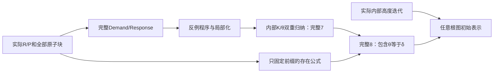
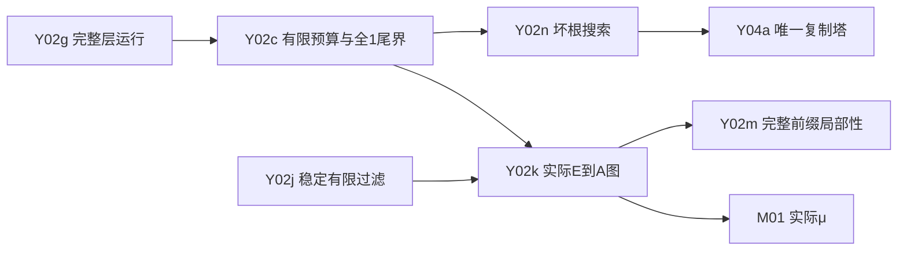
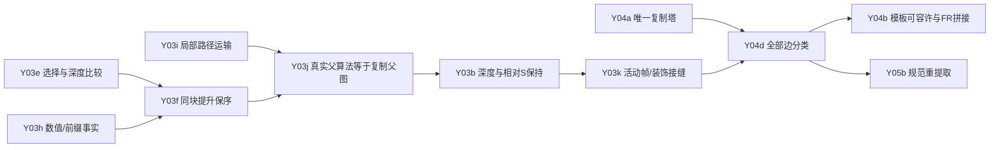
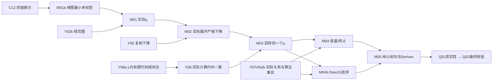

> 当前快照：第七批429项/2892声明通过。实际μ、完整矩阵算法与I/S、三种单层复制、Prefix/Lex和L有限输入闭合已完成。当前87节点、20项必要实现工作包。下述依赖梗概保持有效；旧的待完成描述以[当前交接](CURRENT.md)为准。

# 形式化证明梗概

最终要在对象 KPω 内，从任意给定不可数序数 ν 构造序数 χ≤ν 和实际集合函数 μ:E→χ，使 μ(空)=0，每次非空表达式的实际展开都使 μ 严格下降。然后得到内部良基、集合编码轨迹终止、Desc(s)/G 的字典序良序，并输出纯 ∈ 闭句的 Hilbert Derives。

说明性公式：`KPω ⊢ ∀ν [UncountableOrdinal(ν) → ∃χ≤ν ∃μ:E→χ (μ(∅)=0 ∧ ∀s∈E\{∅} ∀N∈ω μ(E_N(s))<μ(s))]`。

E 是空序列或首项 1 的内部有限正整数序列。N 为额外复制次数，N=0 删除末项；真前缀在字典序中较小。没有断言整个 E 字典序良序。

依据为[用户文稿](../../1Y-Well-Ordering-KP-Simplified.pdf)与[原仓库审读](../../verification-1y/REVIEW.zh-CN.md)。详细逐任务输入、唯一文件和验收见[依赖清单](DEPENDENCIES.md)，当前证据见[交接快照](CURRENT.md)。

## 1. 对象理论与 L：已有集成证据

F01–F05 从纯 ∈ 语法开始定义 KPω：外延、空集、配对、并集、无穷、Δ₀ 分离、Δ₀ 收集及完整集合归纳。内部有限序列、函数图、自然数归纳和 Σ₁ 递归均使用实际对象集合，不假定模型 ω 标准或宿主成员关系良基。

实际构造 L 并证明内部 KPω+V=L、内外 ω 与序数一致。从 ν 得到 L 内最小不可数 κ≤ν 及统一可数枚举；κ 无需在外部仍不可数。

## 2. R/FR 与完整反射：已集成

F06 构造实际 R 表，证明文稿方程、严格端点和根弱化。F03/F07 构造实际满意度、Skolem 闭包及初等高度。C01–C12 把文稿的有限公式编译为任意内部长度的真实程序。

(7) 的归纳假设已消除；(8) 不把 δ 或 θ=δ 当小结构参数，只固定前缀，反射出 g<δ，再用 (7) 改写端点。初始表示覆盖宽度 0 和任意内部图边层号。

## 3. 表达式、完整山形与规范图：正在汇合

Y01/Y02a 已有表达式、内部算术、父森林、路径、根/深度和最右继承选择。Y02e–g 新交付高度和顶部值图、精确伪父与提取、整个内部 ω 层运行。

剩余工作是给每个表达式实际产生有限规范根图并收集为函数。稳定过滤按固定 `(层,列,行)` 顺序枚举全部真实边，保留重复，不添加填充原子；图边条件必须双向对应。预算先交给图构造，坏根不阻塞 μ。完整前缀局部性还要处理行运行、提取和层运行，不能仅引用森林前缀。

## 4. 0-Y/BM4 的有限结构：当前主要难点

调用清单已确认原 expand_lastRepresentation_lower 的有限主链不消费 WF(0-Y/BM4)。因此可复用有限证明思路，但宿主 Nat/List 的事实仍需迁移到任意 KP 模型的内部集合编码。仅比较 Z₂ 与 KPω 的强度不能自动导入对象推导；Z01 是可选来源调查。

实际矩阵展开核心、通用帧与重建已集成。新交付还有任意矩阵父运行、共同链选择/深度比较、局部森林嵌入和精确复制坐标。

三个不同的验收边界是：构造候选复制父图；证明它恰好是输出矩阵重新计算的父图；再证明深度、S、活动帧及重提取保持。不能把第一步算作后两步。Y04/Y05 必须读取同一份 CopyTower；raw 1-Y decoder 与 BMS seam 的差一是独立核对点。

## 5. 实际展开与复制下降：两路汇合

Y05c 从同一复制塔与通用重建形成实际 E×ω→E 图，覆盖空、删除、无坏根和复制分支。Y05b 进一步证明重建后重新提取恢复同一个塔，识别 A(E_N(s))。通用重建自身没有提供这个规范性结论。

Y04c/d/b 则从原表示提取源事实、模板，验证 Adm，用 FR 逐块拼接，并以对象归纳覆盖所有内部 N。两支在 Y06 汇合：末标签 β 的原表示，经实际展开后得到末标签小于 β 的表示。这才是有限复制下降的对象版本。

## 6. μ、绝对性与具体推论

M01a 可先对任意根图做最小末标签。规范图交付后，M01 构造实际 μ，空表达式赋 0，非空最小值有实现它的表示。M02 使用 Y06 得到所有真实展开严格下降。

O01/O02 的通用对象定理已证明，具体条件仍由独立任务填入：Y07r 构造内部有限 Reach 与首步分解，Y07l 构造实际 Lex，Y07a/b 提供展开前缀、字典序、种子与共同祖先事实。

相同 ω 不足以完成 Y08：全部内部有限代码必须实际在 L 中，还要用内部存在、证书绝对性与外部唯一性识别同一个展开。M03 回传实际 μ 集合，不能从“L 内无下降链”直接得外部良基。

## 剩余规模与完工标准

本次拆分为 78 个任务节点：25 个必要实现包尚未交付，新增交付随批次核验，另有 1 个可选调查；其余为已核验或已有审读记录。拆细节点没有增加数学义务，也不表示完成百分比。

主要长链是复制父图识别→结构保持→活动帧/边分类→规范重提取→μ下降→L回传→最终闭句。最大未知工作量集中在有限组合部分。目前不能可靠承诺剩余小时或加速倍数；最终必须有实际闭句 Derives，并通过命题忠实性和公理审计。
